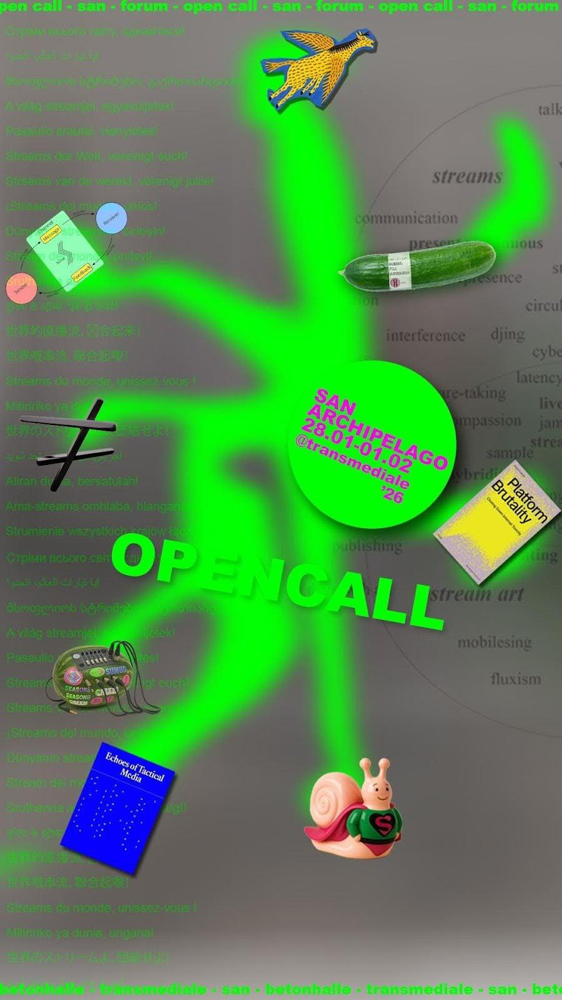

Between 28 Jan and 1 Feb 2026, GNNL_TV joins the fellow streamonauts of the StreamArtNetwork at transmediale '26 in Berlin, online, and across all realities of your choosing. Join us at Silent Green Kulturquartier or tune in [here](https://widget.streame.io/landing/1043cbyovg0handm3a4rz257), [there](https://www.youtube.com/@streamartstudio) and [anywhere](https://www.twitch.tv/konfluxuscollective). The SAN Archipelago programme features Open Call sessions - just drop in our join via Jitsi - and we'll be helping CDI-TV launch a new xpub.

